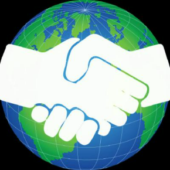

`oSoWoSo`  
open Source World Society
================================  
website
- https://osowoso.org

Repository
----------

- [code/](code/) - code referenced in various YouTube (non-YSAP series) videos. *
- [episodes/](episodes/) - scripts and notes used during YSAP videos. *
- [patreon/](patreon/) - scripts and programs used for patreon shoutouts.  *
- [tools/](tools/) - helper tools used for content creation. *
- [website/](website/) - scripts used for creating the [ysap.sh](https://ysap.sh) site. * Reused for [osowoso](https://osowoso.org)

You can also access it on your terminal with:

    curl osowoso.org/index.txt

License
-------

All code licensed under the MIT License

* by [Dave Eddy](https://github.com/bahamas10)
[ysap.sh](https://ysap.sh)  
  Thanks Dave

remade by [zenobit](https://codeberg.org/zenobit)

